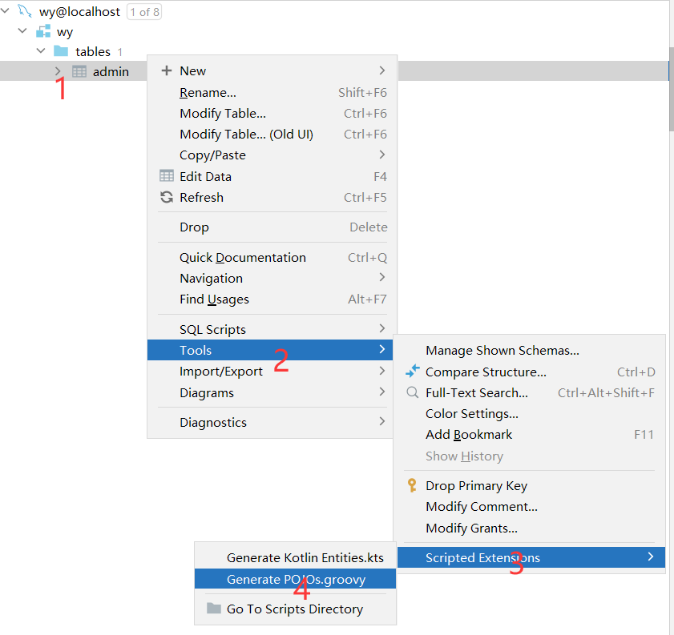
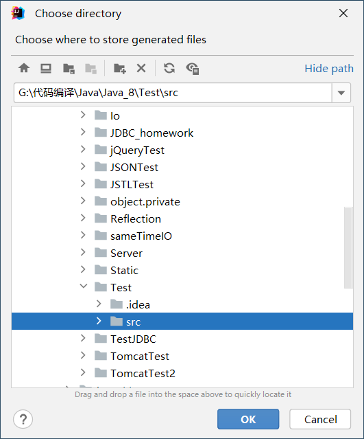
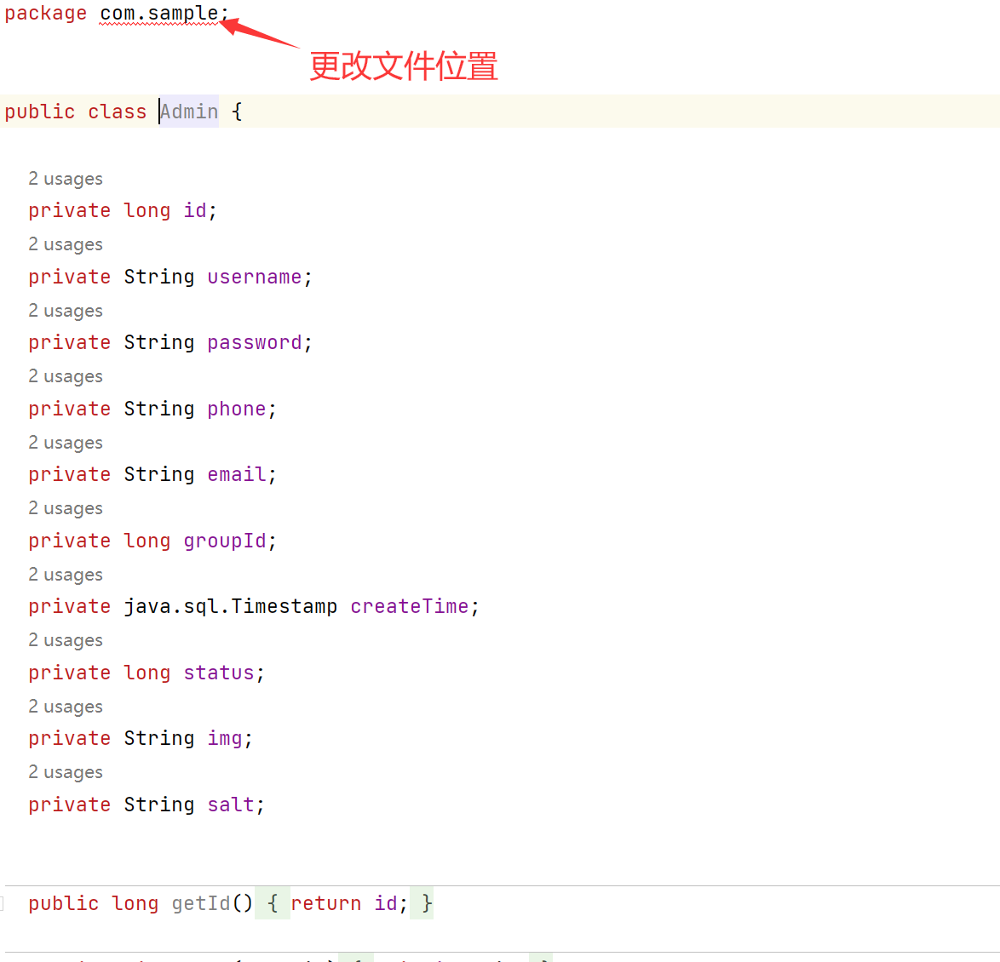

# Idea2022-1-4连接MySQL数据库5-1并快捷创建实体类

## 前言

最近学习用到了，在 `Idea` 中连接数据库，并且快捷创建实体类，中间发现了一个很重要的问题，就是 `Idea 2022.1.4` 他把创建实体类的按钮直接放在了别 `Tools` 里面，我花了将近一个小时才真正的找到，感谢我的老师。

过程中，我差点把自己的 `Idea` 给卸载了，但是因为配置了 `Tomcat` 就狠心继续往下找，功夫不负有心人，最后终于找到了。

## 过程说明

> 1. 快捷生成实体类对象
> 2. 选择要生成的文件夹

## 最后

**过程省略很多, 但是已经有人写出更详细的教程, 链接如下**

[idea 连接数据库详细教程（新手篇）2021版idea_勤俭节约的程序猿的博客-CSDN博客_idea2021连接数据库](https://blog.csdn.net/m0_55913607/article/details/119644662?ops_request_misc=%7B%22request%5Fid%22%3A%22166314957116782391836898%22%2C%22scm%22%3A%2220140713.130102334..%22%7D&request_id=166314957116782391836898&biz_id=0&utm_medium=distribute.pc_search_result.none-task-blog-2~all~top_click~default-2-119644662-null-null.142^v47^pc_rank_34_queryrelevant25,201^v3^add_ask&utm_term=idea连接数据库&spm=1018.2226.3001.4187)
