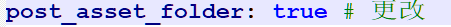
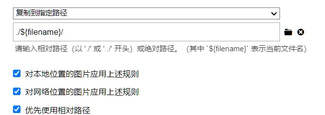

# Hexo + Github 个人博客搭建教程


> 声明: 本教程大部分按照 B站up主: [CodeSheep的个人空间_哔哩哔哩_](https://space.bilibili.com/384068749) 其下的 [手把手教你从0开始搭建自己的个人博客 |无坑版视频教程| hexo](https://www.bilibili.com/video/BV1Yb411a7ty?share_source=copy_web&vd_source=3f9584b64cb68f5f3df72a4d97a0eb54) 执行, 所以如果不想看文本介绍, 也可以直接看up主的视频, 其中用到的主题叫 [hexo-theme-matery](https://github.com/blinkfox/hexo-theme-matery/blob/develop/README_CN.md)
>
> 这个 `hexo` 框架在网络上比较成熟, 能查到很多自己出现的问题
>
> 我是个人从放假开始, 就自学了一个月, 最后到熟练, 过程痛苦且复杂, 但是结果还是好的
>
> 博客呢, 对于每一个程序员来说, 不管是校招还是社招, 在应聘工作时, 是一个很好的对于自己技术检验的, 所以在学习中, 如果能闲下心来, 去做一些, 有关博客搭建, 或者通过一些技术手段, 实现一些小的功能, 都能为自己的技术经验添上浓墨重彩的一笔.
>
> 以下所涉及的软件的所有安装包, 我都已经整理好在我的QQ群里了, 可以直接进入QQ群进行下载 `746049995`
>
> 那么接下来, 废话少说, 直接进入正题


## 1. GitHub 环境配置


### 1.1 Github 不用魔法的环境配置

首先, 需要你确定你的电脑( 不在使用魔法的情况下 )是否能够轻松打开 [GitHub](https://github.com/) 如果能够打开, 请直接进入下一步.


如果不能够打开, 需要我们进行环境网络配置

> 1. 首先进入 [The Best IP Address, Email and Networking Tools - IPAddress.com](https://www.ipaddress.com/) 这个网站
>
> 2. 然后将 `GitHub` 的网站 www.github.com 输入进搜索栏
>
>    
>
> 3. 得到你的 `IP Address` 
>
>    
>
> 4. 复制这个地址, 下来进入
>
>    此电脑 -> C盘 -> Windows -> System32(可能位置很靠下, 这是一个文件夹) -> drivers -> etc -> hosts
>    
>    
>    
>
> ---
>
>    
>
> ---
>
> 
>
> ---
>
>    
>
> ---
>
>    
>
> ---
>
> 
>
> ---
>
> 


`到了这里, 我们就可以进入hosts文件了`

我们首先复制 `hosts` 文件到桌面 -> 右键(打开方式 记事本打开) -> 在最后一行粘贴你刚刚所复制的域名地址 -> 在域名地址后面写上 `github.com` -> `Ctrl+s` 对文件进行保存 -> 最后重新拖回刚刚的源文件, 点击进行替换.


> 
>
> ---
>
> 
>
> **!!!!!!! 注意 这里并不需要填写  `#` 只需要直接写入刚刚复制的域名就可以, 后面加上 `github.com` !!!!!!!!!**
>
> ---
>
> 

此时, 你已经初步拥有了进入 `Github`不需要任何魔法的进入了,  [GitHub](https://github.com/) 可以访问了


### 1.2 使用魔法环节


刚刚的一步, 你已经初步拥有了踏入 `GitHub` 大门的资格, 但还是少了点东西, 不能随便白嫖, 非常容易受到网络的限制, 那么怎么办呢?


> 我们使用一个具有魔法的软件 [Watt Toolkit - 下载 (steampp.net)](https://steampp.net/download) (原Steam++) 
>
> 
>
> 进入软件之后, 下拉, 我们可以看到 `Github` 选项 -> 选择所有的 -> 点击 `一键加速` 就可以享受魔法的快乐啦~
>
> 
>
> ---
>
> 


### 1.3 试验环节


不在C盘, 在其他的盘符创建自己的文件夹, 随便命名都可以 然后右击 点击 `Git Bash Here`


---

在使用 `steam++` 加速的环境下, 向里面输入 `请注意不要使用 Ctrl + c 进行粘贴, 不适用`


```yaml
git clone https://github.com/blinkfox/hexo-theme-matery.git
```


也可以复制粘贴, 但是粘贴跟我们以前的不太一样, 用到的是 `Shift + Ins (Insert)` 这两个按键


已经下载好了


> 如果你的下载不成功, 可以再试几次
>
> 如果你的下载停了, 可以使用 `Ctrl + c` 退出当前进程, 然后再执行一遍当前代码, 可以使用 `↑` 按键, 直接使用上一次运行代码, 或者检查一下, 原代码填写的是否有误.
>
> 如果一直不成功, 可以进入QQ群的群公告查找方法.


**恭喜你, 你已经成功了一半了**


### 1.4 文本编译器选择


> 你需要一个 [Notepad++ v8.4.4](https://github.com/notepad-plus-plus/notepad-plus-plus/releases/download/v8.4.4/npp.8.4.4.Installer.x64.exe) 或者 [Vscode]([Visual Studio Code - Code Editing. Redefined](https://code.visualstudio.com/)) (点击名称即可进入下载地址)
>
> `VScode` 可能会更好, 对于初学者而言, 我更推荐后者


### 1.5 Git软件下载


在使用 `hexo`  的时候, 必不可少的就是 `Git` 因为作为一个程序员的标准, 就是要会使用 `Github` 和 `Git` 工具的使用, 对以后的团队开发, 以及版本更新, 都是一个得力工具, 所以使用 `Github` 会让人事半功倍. 顺便还要注册 `Github` 账号, 那么下面的视频博主所教学的, 非常适合你, 而第一个链接适合那些, 已经对 `Github` 有所了解的.


[Git教程链接](http://t.csdn.cn/1x0d4) 请一定要耐下心来, 每一个步骤都要看好 或者 可以观看 B站up主: [冯雨 Github 新手够用指南 | 全程演示&个人找项目技巧放送](https://www.bilibili.com/video/BV1e541137Tc?share_source=copy_web&vd_source=3f9584b64cb68f5f3df72a4d97a0eb54) 

`创建账号的时候, 用户名英文, 不要太多的符号!!!!!   不要太多的符号!!!!! 要不建库的时候会有点难受`

**一定要注意在教程的 `2.2.5 选择Git默认编辑器` **

 你自己要根据本章 第 `1.1 文本编辑器` 所选择的文本编译器选择合适的版本. `并且在安装版本前, 请一定要注意, 你的电脑已经有了需要你下载的文本编译器的其中一个`

> 如果你选择的是 `Notepad++` 那么就需要选择

---

> 如果你选择的是 `VScode` 那么要选择

其他的按照视频里面的 或者 文档里面的介绍来, 就可以了. 这一步往下全都是默认, 往死里点 `next` 也可以


## 2.  Hexo 环境配置


### 2.1 Node.js 环境下载


> 关于 `Hexo` 呢, 我们首先需要的就是 `node.js` 
>
> 1. `Node.js` 是一个开源和跨平台的 `JavaScript` 运行时环境。它几乎是任何类型项目的流行工具！
>
> 2. `Node.js` 在浏览器之外运行 `V8 JavaScript` 引擎（ `Google Chrome` 的内核）。这使得 `Node.js` 的性能非常好。
>
> 3. `Node.js` 应用程序在单个程序中运行，无需为每个请求创建新的线程。`Node.js` 在其标准库中提供了一组异步的I/O原语，以防 `JavaScript` 代码阻塞，通常，`Node.js` 中的库是使用非阻塞范式编写的，使得阻塞行为成为异常而不是常态。
>
> 4. `Node.js` 具有独特的优势，因为数百万为浏览器编写的 `JavaScript` 的前端开发者现在无需学习完全不同的语言，就可以编写除客户端代码之外的服务器端代码。


我使用的版本 [Node.js v14版本](https://nodejs.org/dist/latest-v14.x/node-v14.20.0-x64.msi) `版本并不是越新越好`


> Step1: 点击安装包
>
> 
>
> 
>
> Step2: 安装程序
>
> 1. `如果` 使用默认配置安装一直点 `next` 即可，安装路径默认在 `C:\` 下，也可以自定义修改
>
>    
>
> 
>
> 2. 安装路径默认在 `C:\` 下面，也能够自定义修改，而后点击next（我这里设置我的安装目录为 `D:\`  , 其他的所有都没有动, 也就是说只需要把 `C 改为 D` 即可
>
>    
>   
>       
>   
> 3. 下图根据本身的需要进行，我选择了默认 `Node.js runtime` ，而后 `Next`
>
>    `Node.js runtime` ：表示运行环境
>    `npm package manager` ：表示npm包管理器
>    `online documentation shortcuts` ：在线文档快捷方式
>    `Add to PATH` ：添加到环境变量
>
>    
>
> 
>
> 4. 以下图框中所示，我没有选中，而是直接 `next`
>
> 
>
> 5. 点击 `Install` ，进行安装
>
> 
>
> 6. 点击 `finish` ，完成安装
>
> 


> 下载完成后, 我们可以进入, 控制台, 来看看自己的安装是否做好了
>
> 右击桌面空白 -> 点击 `Git Bash Here` -> 然后执行命令
>
> ```yaml
> node -v
> ```
>
> 执行过后, 如下图
>
> 
>
> 再执行命令
>
> ```yaml
> npm -v
> ```
>
> 执行过后, 如下图
>
> 


## 3. 博客搭建


### 3.1 预备配置


在我们的验证过程中, 需要用到 `用户名` 和 `密码` 的输入环节, 所以这时候, 就需要你自己来配置一下, 右击 `桌面` 空白处, 点击 `Git Bash Here`.


配置如下:

> 首先设置自己的邮箱名字
>
> ```yaml
> git config --global user.email "xxx"
> ```
>
> 双引号里面填写你的QQ账号邮箱地址, 例: `xxx(这里填写你的QQ号)@qq.com`  , `务必加上双引号, 这对你很重要`
>
> ```yaml
> git config --global user.name "xxx"
> ```
>
> 双引号里面填写你的昵称, `务必加上双引号`
>
> 效果图如下:
>
> 
>
> 


### 3.2 进入实战

我们的操作是如下几部分 ( `#` 是注释, 不要直接复制 )

> ```yaml
> node -v	#查看node版本
>     
> npm -v	#查看npm版本
>     
> npm install -g cnpm --registry=http://registry.npm.taobao.org	#安装淘宝的cnpm 管理器
> 
> cnpm -v	#查看cnpm版本
>     
> cnpm install -g hexo-cli    #安装hexo框架
>     
> hexo -v	#查看hexo版本
>     
> hexo init 	#生成博客 初始化博客
>     
> hexo s	#启动本地博客服务
>     
> http://localhost:4000/	#本地访问地址
> 
> hexo n "我的第一篇文章" #创建新的文章
>     
> hexo clean #清理
> hexo g #生成
> #Github创建一个新的仓库 YourGithubName.github.io
> cnpm install --save hexo-deployer-git #在blog目录下安装git部署插件
> 
> ----
> 
> #配置_config.yml 
> 
> 	# Deployment
> 	## Docs: https://hexo.io/docs/deployment.html
> 	deploy:
>   		type: git
>  		repo: https://github.com/YourGithubName/YourGithubName.github.io.git
>   		branch: master
>         
> -----
> 
> hexo d	#部署到Github仓库里
> https://(YourGithubName.github).io/  #访问这个地址可以查看博客
> ```
>
> 

首先, 不要选择 `C盘`, 可以选择其他盘符,  然后创建一个 `blog` 文件夹, 我们下来的操作都在这个文件夹里面执行.

可以配合着 [手把手教你从0开始搭建自己的个人博客 |无坑版视频教程| hexo](https://www.bilibili.com/video/BV1Yb411a7ty?share_source=copy_web&vd_source=3f9584b64cb68f5f3df72a4d97a0eb54) 观看接下来的操作, 博主使用的 `Mac` 系统, 与我们的系统, 都是差不多的命令, `windows` 完全可以照着我的来.

**作者里面的, 进入blog博客文件夹, 我们不用再操作了, 因为我们已经在进入第一步就开始了, 如图 (我里面的 /e 可以不一样, 因为是不同的盘, 不管什么盘, 你能显示 `blog` 文件夹就行)**

 

> 1. 进入创建的 `blog` 文件夹后, `右键` 空白处, 选择 `Git Bash Here` , 然后输入以下命令 (不要管我们的差异, 都是一样的模块, 也不要看我前面为什么跟你的不一样, `Git Bash Here` 和 `PowerShell(管理员)` 执行的结果都一样, 且`Git` 直接可以帮你把环境配置好)
>
> ```yaml
> npm install -g cnpm --registry=https://registry.npm.taobao.org
> ```
>
> 
>
> 
>
> 2. 下来查看你的 `镜像` 是否真正搭建好了
>
> 
>
> 
>
> 3. 安装 `Hexo` 框架
>
> ```yaml
> cnpm install -g hexo-cli
> ```
>
> 
>
> 
>
> 4. 查看 `Hexo` 版本
>
> ```yaml
> hexo -v
> ```
>
> 
>
> 
>
> 5. `Hexo` 博客初始化
>
> ```yaml
> hexo init
> ```
>
> `有人会在这一步卡好长时间, 有可能半个小时`
>
> 
>
> 
>
> 6. 启动本地博客服务
>
> ```yaml
> hexo s
> ```
>
> 
>
> 
>
> 7. 进入博客本地页面
>
> ```yaml
> http://localhost:4000/
> ```
>
> 
>
> **现在离成功已经不远了**
>
> 
>
> 8. 创建一个新的 `.md` 文件
>
> ```yaml
> hexo n "主页"
> ```
>
> 
>
> *你可以直接通过文件夹进入, 视频进入方法, 因为没有专门的编译器是行不通的*
>
> 可以按照 `blog` 文件夹 -> `source` 文件夹 -> `_post`文件夹 -> 找到 `主页.md`
>
> 可以随便写写, 也可以不写, 等你熟悉 `Markdown` 语法后, 也可以进行读写
>
> 
>
> 9. 重新生成 ( 清理 -> 生成 -> 建库-> Git插件 )
>
> `下来, 你需要依次输入以下几个代码, 一定要分别输入哦!!!!`
>
> ```yaml
> hexo clean
> ```
>
> ```yaml
> hexo g
> ```
>
> ---
>
> 你可以先停下来, 然后进入 `Github` 网站, 建库
>
> 建库的步骤
>
> 1. 先点击右上角 `+` 号, 第一个选项 `New repository` 
>
> 
>
> 2. 进入之后, 按照以下操作
>
>    
>
>    
>
> 3. 点击 `Create repository`
>
>    
>
> 4. 你就可以拥有自己的库了
>
> 
>
> 
>
> 5. 部署 `Git` 插件
>
> ```yaml
> cnpm install --save hexo-deployer-git
> ```
>
> 
>
> 
>
> 6. 配置 `blog` 目录下 `_config.yml ` 文件, 这个文件你可以 用 `右击` 选择 `VScode` 打开 `此配置行数在 104 行`
>
> **!!!!!!! 请记住, 我们的 `branch` 是在 `main` 里面, 而不是 `master` !!!!!!**
>
> 
>
> `保存之后进入下一步`
>
> 7. 部署博客
>
> ```yaml
> hexo d
> ```
>
> 通过访问 `https://zgchenzhen.github.io` 就可以进入我的博客了, 那么你们也就可以把 `zgchenzhen` 换为你们自己的名称即可
>
> 


## 4. 主题文件

我们的主题文件配置 可以参照 [hexo-theme-matery](https://github.com/blinkfox/hexo-theme-matery/blob/develop/README_CN.md) 对于熟练的人, 可能看我接下来的, 要比你看这个文档慢得多, 所以先推荐你去看看博主的文档, 再回来看我的文档 

并且还有配套视频 [hexo搭建个人博客超简单效果超好的个人网站博客搭建对小白很友好](https://www.bilibili.com/video/BV1Rt4y1k7it?p=7&share_source=copy_web&vd_source=3f9584b64cb68f5f3df72a4d97a0eb54)

**找不到的话, 如果你使用的是 `NotePad++ `可以使用 `Ctrl + F` 进行搜索关键词, 快速找到位置**


### 4.1 下载和转移

还记得, 我让你们在 `1.3试验环节` 做的  `git clone` 操作吗?

里面的 `matery` 就是我们这次要使用的主题

> 首先, 将整个文件 `复制 粘贴` 到 `blog 文件夹` / `themes 文件夹 ` / 
>
> 

### 4.2 配置

#### 切换主题

> 修改 `Blog` (也有的网站叫做 ` Hexo 根目录下`) 目录下的 `_config.yml` 的 `theme 值 (在第 100 行)` : `theme: hexo-theme-matery`


####  _config.yml 文件的其它修改建议:

> - 请修改 `_config.yml` 的 `url` 的值为你的网站主 `URL`（如：`http://xxx.github.io`）。`在第 16 行 `
>
> - 
>
> - 建议修改两个 `per_page` 的分页条数值为 `6` 的倍数，如：`12`、`18` 等，这样文章列表在各个屏幕下都能较好的显示。     `在第 65 和 88 行`
>
> - 
>
> - 如果你是中文用户，则建议修改 `language` 的值为 `zh-CN`。`在第 11 行` 你可以顺便把你别的改了, 具体看我的图片内容
>
> - 
>
> - 关于图片上传, 无法显示的问题, 在 `2022-08-14` 已得到解决
>
>   在主文件的配置中找到 `post_asset_folder` 将 `false` 改为 `true`
>
>   
>
>   在你的 `blog文件夹下` 需要下载一个 `插件` 使用 `右键 Git Bash Here`
>
>   ```xml
>   cnpm install https://github.com/CodeFalling/hexo-asset-image
>   ```
>
>   然后, 在 `Typora` 中使用设置图片的路径, 
>
>   
>
>   下来你就可以轻松使用了


#### 新建分类 categories 页

> `categories` 页是用来展示所有分类的页面，如果在你的博客 `source` 目录下还没有 `categories` 文件，那么你就需要新建一个，命令如下：
>
> ```yaml
> hexo new page "categories"
> ```
>
> 编辑你刚刚新建的页面文件 `/source/categories/index.md`，至少需要以下内容：
>
> ```yaml
> ---
> title: categories
> date: 2018-09-30 17:25:30
> type: "categories"
> layout: "categories"
> ---
> ```


#### 新建标签 tags 页

> `tags` 页是用来展示所有标签的页面，如果在你的博客 `source` 目录下还没有 `tags` 文件，那么你就需要新建一个，命令如下：
>
> ```yaml
> hexo new page "tags"
> ```
>
> 编辑你刚刚新建的页面文件 `/source/tags/index.md`，至少需要以下内容：
>
> ```yaml
> ---
> title: tags
> date: 2018-09-30 18:23:38
> type: "tags"
> layout: "tags"
> ---
> ```


#### 新建关于我 about 页

> `about` 页是用来展示**关于我和我的博客**信息的页面，如果在你的博客 `source` 目录下还没有 `about` 文件，那么你就需要新建一个，命令如下：
>
> ```yaml
> hexo new page "about"
> ```
>
> 编辑你刚刚新建的页面文件 `/source/about/index.md`，至少需要以下内容：
>
> ```yaml
> ---
> title: about
> date: 2018-09-30 17:25:30
> type: "about"
> layout: "about"
> ---
> ```


#### 新建留言板 contact 页（可选的）

> `contact` 页是用来展示**留言板**信息的页面，如果在你的博客 `source` 目录下还没有 `contact` 文件，那么你就需要新建一个，命令如下：
>
> ```yaml
> hexo new page "contact"
> ```
>
> 
>
> 编辑你刚刚新建的页面文件 `/source/contact/index.md`，至少需要以下内容：
>
> ```yaml
> ---
> title: contact
> date: 2018-09-30 17:25:30
> type: "contact"
> layout: "contact"
> ---
> ```
>
> > **注**：本留言板功能依赖于第三方评论系统，请**激活**你的评论系统才有效果。并且在主题的 `_config.yml` 文件中，第 `19` 至 `21` 行的“**菜单**”配置，取消关于留言板的注释即可。


#### 新建友情链接 friends 页（可选的）

`friends` 页是用来展示**友情链接**信息的页面，如果在你的博客 `source` 目录下还没有 `friends` 文件，那么你就需要新建一个，命令如下：

```
hexo new page "friends"
```

编辑你刚刚新建的页面文件 `/source/friends/index.md`，至少需要以下内容：

```yaml
---
title: friends
date: 2018-12-12 21:25:30
type: "friends"
layout: "friends"
---
```

同时，在你的博客 `source` 目录下新建 `_data` 目录，在 `_data` 目录中新建 `friends.json` 文件，文件内容如下所示：

```yaml
[{
    "avatar": "http://image.luokangyuan.com/1_qq_27922023.jpg",
    "name": "码酱",
    "introduction": "我不是大佬，只是在追寻大佬的脚步",
    "url": "http://luokangyuan.com/",
    "title": "前去学习"
}, {
    "avatar": "http://image.luokangyuan.com/4027734.jpeg",
    "name": "闪烁之狐",
    "introduction": "编程界大佬，技术牛，人还特别好，不懂的都可以请教大佬",
    "url": "https://blinkfox.github.io/",
    "title": "前去学习"
}, {
    "avatar": "http://image.luokangyuan.com/avatar.jpg",
    "name": "ja_rome",
    "introduction": "平凡的脚步也可以走出伟大的行程",
    "url": "https://me.csdn.net/jlh912008548",
    "title": "前去学习"
}]
```


#### 新建 404 页

如果在你的博客 `source` 目录下还没有 `404.md` 文件，那么你就需要新建一个

```
hexo new page 404
```

编辑你刚刚新建的页面文件 `/source/404/index.md`，至少需要以下内容：

```yaml
---
title: 404
date: 2018-09-30 17:25:30
type: "404"
layout: "404"
description: "Oops～，我崩溃了！找不到你想要的页面 :("
---
```


#### 菜单导航配置

##### 配置基本菜单导航的名称、路径url和图标icon.

1.菜单导航名称可以是中文也可以是英文(如：`Index`或`主页`) 2.图标icon 可以在[Font Awesome](https://fontawesome.com/icons) 中查找

```yaml
menu:
  Index:
    url: /
    icon: fas fa-home
  Tags:
    url: /tags
    icon: fas fa-tags
  Categories:
    url: /categories
    icon: fas fa-bookmark
  Archives:
    url: /archives
    icon: fas fa-archive
  About:
    url: /about
    icon: fas fa-user-circle
  Friends:
    url: /friends
    icon: fas fa-address-book
```


##### 二级菜单配置方法 (我并没有使用这个方法)

如果你需要二级菜单则可以在原基本菜单导航的基础上如下操作

1. 在需要添加二级菜单的一级菜单下添加`children`关键字(如:`About`菜单下添加`children`)
2. 在`children`下创建二级菜单的 名称name,路径url和图标icon.
3. 注意每个二级菜单模块前要加 `-`.
4. 注意缩进格式

```yaml
menu:
  Index:
    url: /
    icon: fas fa-home
  Tags:
    url: /tags
    icon: fas fa-tags
  Categories:
    url: /categories
    icon: fas fa-bookmark
  Archives:
    url: /archives
    icon: fas fa-archive
  About:
    url: /about
    icon: fas fa-user-circle-o
  Friends:
    url: /friends
    icon: fas fa-address-book
  Medias:
    icon: fas fa-list
    children:
      - name: Music
        url: /music
        icon: fas fa-music
      - name: Movies
        url: /movies
        icon: fas fa-film
      - name: Books
        url: /books
        icon: fas fa-book
      - name: Galleries
        url: /galleries
        icon: fas fa-image
```


#### 代码高亮

从 `Hexo5.0` 版本开始自带了 `prismjs` 代码语法高亮的支持，本主题对此进行了改造支持。

如果你的博客中曾经安装过 `hexo-prism-plugin` 的插件，那么你须要执行 `npm uninstall hexo-prism-plugin` 来卸载掉它，否则生成的代码中会有 `{` 和 `}` 的转义字符。

然后，修改 `Blog` 根目录下 `_config.yml` 文件中 `highlight.enable` 的值为 `false`，并将 `prismjs.enable` 的值设置为 `true`，主要配置如下：

```yaml
highlight:
  enable: false
  line_number: true
  auto_detect: false
  tab_replace: ''
  wrap: true
  hljs: false
prismjs:
  enable: true
  preprocess: true
  line_number: true
  tab_replace: ''
```

主题中默认的 `prismjs` 主题是 `Tomorrow Night`，如果你想定制自己的主题，可以前往 [prismjs 下载页面](https://prismjs.com/download.html) 定制下载自己喜欢的主题 `css` 文件，然后将此 css 主题文件取名为 `prism.css`，替换掉 `hexo-theme-matery` 主题文件夹中的 `source/libs/prism/prism.css` 文件即可。


#### 搜索

本主题中还使用到了 [hexo-generator-search](https://github.com/wzpan/hexo-generator-search) 的 `Hexo` 插件来做内容搜索，安装命令如下：

```yaml
cnpm install hexo-generator-search --save
```

在 Hexo 根目录下的 `_config.yml` 文件中，新增以下的配置项：

```yaml
search:
  path: search.xml
  field: post
```


#### 中文链接转拼音（建议安装）

如果你的文章名称是中文的，那么 Hexo 默认生成的永久链接也会有中文，这样不利于 `SEO`，且 `gitment` 评论对中文链接也不支持。我们可以用 [hexo-permalink-pinyin](https://github.com/viko16/hexo-permalink-pinyin) Hexo 插件使在生成文章时生成中文拼音的永久链接。

安装命令如下：

```yaml
cnpm i hexo-permalink-pinyin --save
```

在 Hexo 根目录下的 `_config.yml` 文件中，新增以下的配置项：

```yaml
permalink_pinyin:
  enable: true
  separator: '-' # default: '-'
```

> **注**：除了此插件外，[hexo-abbrlink](https://github.com/rozbo/hexo-abbrlink) 插件也可以生成非中文的链接。


#### 文章字数统计插件（建议安装）

如果你想要在文章中显示文章字数、阅读时长信息，可以安装 [hexo-wordcount](https://github.com/willin/hexo-wordcount)插件。

安装命令如下：

```yaml
cnpm i --save hexo-wordcount
```

然后只需在本主题下的 `_config.yml` 文件中，将各个文章字数相关的配置激活即可：

```yaml
postInfo:
  date: true
  update: false
  wordCount: false # 设置文章字数统计为 true.
  totalCount: false # 设置站点文章总字数统计为 true.
  min2read: false # 阅读时长.
  readCount: false # 阅读次数.
```


#### 修改打赏的二维码图片

在主题文件的 `source/medias/reward` 文件中，你可以替换成你的的微信和支付宝的打赏二维码图片。**名字都不要改!!!!**


## 5. 文章 Front-matter 介绍

### Front-matter 选项详解

`Front-matter` 选项中的所有内容均为**非必填**的。但我仍然建议至少填写 `title` 和 `date` 的值。

| 配置选项      | 默认值                         | 描述                                                         |
| ------------- | ------------------------------ | ------------------------------------------------------------ |
| title         | `Markdown` 的文件标题          | 文章标题，强烈建议填写此选项                                 |
| date          | 文件创建时的日期时间           | 发布时间，强烈建议填写此选项，且最好保证全局唯一             |
| author        | 根 `_config.yml` 中的 `author` | 文章作者                                                     |
| img           | `featureImages` 中的某个值     | 文章特征图，推荐使用图床(腾讯云、七牛云、又拍云等)来做图片的路径.如: `http://xxx.com/xxx.jpg` |
| top           | `true`                         | 推荐文章（文章是否置顶），如果 `top` 值为 `true`，则会作为首页推荐文章 |
| hide          | `false`                        | 隐藏文章，如果`hide`值为`true`，则文章不会在首页显示         |
| cover         | `false`                        | `v1.0.2`版本新增，表示该文章是否需要加入到首页轮播封面中     |
| coverImg      | 无                             | `v1.0.2`版本新增，表示该文章在首页轮播封面需要显示的图片路径，如果没有，则默认使用文章的特色图片 |
| password      | 无                             | 文章阅读密码，如果要对文章设置阅读验证密码的话，就可以设置 `password` 的值，该值必须是用 `SHA256` 加密后的密码，防止被他人识破。前提是在主题的 `config.yml` 中激活了 `verifyPassword` 选项 |
| toc           | `true`                         | 是否开启 TOC，可以针对某篇文章单独关闭 TOC 的功能。前提是在主题的 `config.yml` 中激活了 `toc` 选项 |
| mathjax       | `false`                        | 是否开启数学公式支持 ，本文章是否开启 `mathjax`，且需要在主题的 `_config.yml` 文件中也需要开启才行 |
| summary       | 无                             | 文章摘要，自定义的文章摘要内容，如果这个属性有值，文章卡片摘要就显示这段文字，否则程序会自动截取文章的部分内容作为摘要 |
| categories    | 无                             | 文章分类，本主题的分类表示宏观上大的分类，只建议一篇文章一个分类 |
| tags          | 无                             | 文章标签，一篇文章可以多个标签                               |
| keywords      | 文章标题                       | 文章关键字，SEO 时需要                                       |
| reprintPolicy | cc_by                          | 文章转载规则， 可以是 cc_by, cc_by_nd, cc_by_sa, cc_by_nc, cc_by_nc_nd, cc_by_nc_sa, cc0, noreprint 或 pay 中的一个 |

> **注意**:
>
> 1. 如果 `img` 属性不填写的话，文章特色图会根据文章标题的 `hashcode` 的值取余，然后选取主题中对应的特色图片，从而达到让所有文章的特色图**各有特色**。
> 2. `date` 的值尽量保证每篇文章是唯一的，因为本主题中 `Gitalk` 和 `Gitment` 识别 `id` 是通过 `date` 的值来作为唯一标识的。
> 3. 如果要对文章设置阅读验证密码的功能，不仅要在 Front-matter 中设置采用了 SHA256 加密的 password 的值，还需要在主题的 `_config.yml` 中激活了配置。有些在线的 SHA256 加密的地址，可供你使用：[开源中国在线工具](http://tool.oschina.net/encrypt?type=2)、[chahuo](http://encode.chahuo.com/)、[站长工具](http://tool.chinaz.com/tools/hash.aspx)。
> 4. 您可以在文章md文件的 front-matter 中指定 reprintPolicy 来给单个文章配置转载规则

以下是示例

---

title: 基于 Hexo + Github 建立个人博客网站
author: 宗谷
top: true
hide: false
cover: false
toc: false
mathjax: false
summary: '这是一篇关于怎么建立博客的内容, 各位可以放心食用'
categories: Hexo
tags:

  - Github
  - Hexo
abbrlink: 49747
date: 2022-07-22 00:33:44

---


## 最后

### 附带我解决我出现问题的网站

> 1. [Hexo博客发表文章、草稿、添加分类和标签_玖涯的博客-CSDN博客_hexo草稿](https://blog.csdn.net/nineya_com/article/details/103316683)
> 2. [取消hexo的matery主题的背景图遮罩颜色_Android_la的博客-CSDN博客](https://blog.csdn.net/qq_40634846/article/details/109673421)
> 3. [hexo博客matery主题的个性化配置_伊丶二的博客-CSDN博客_matery](https://blog.csdn.net/qq_41376237/article/details/113475727)
> 4. [基于Hexo的matery主题搭建博客并深度优化_天弈初心的博客-CSDN博客_hexo matery主题](https://blog.csdn.net/weixin_44797199/article/details/124711048)


